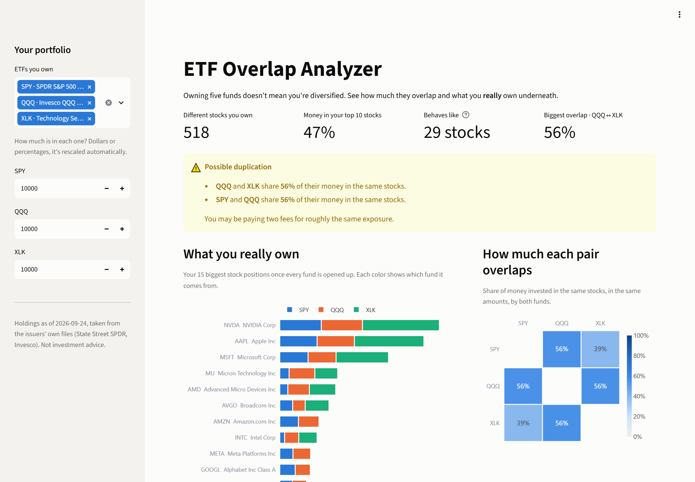

# ETF Overlap Analyzer

**Owning five ETFs doesn't mean you're diversified.** This tool opens up every fund in a portfolio, shows how much the funds duplicate each other, and what you actually own underneath.



[](https://github.com/Lucas123124124123123/etf-overlap-analyzer/actions/workflows/tests.yml)


## The problem

A very common "diversified" portfolio is an S&P 500 fund, a Nasdaq-100 fund and a tech fund. With real holdings from September 2026:

- **86 of the 101 stocks in QQQ are also in SPY**, and 56% of the money in the two funds is invested the same way.
- Split evenly across SPY, QQQ and XLK, the portfolio holds 518 stocks, but **47% of the money sits in just 10 of them**. It behaves like a portfolio of about 29 equally weighted stocks.
- NVIDIA alone ends up at more than 10% of the whole portfolio, because all three funds hold it.

Investors and advisors check this by hand in spreadsheets, or pay for tools that do it. This app answers it in seconds, with the issuers' own daily holdings files.

## What it does

- **Real exposure:** the 15 biggest stock positions after every fund is opened up, colored by the fund each position comes from.
- **Overlap heatmap:** how much each pair of funds overlaps, weighted by money, not just by counting names.
- **Duplication warning:** a plain-language warning when two funds overlap by 50% or more ("you may be paying two fees for the same exposure").
- **Concentration:** share of money in the top 10 stocks, plus the *effective number of stocks* (how many equally weighted stocks the portfolio really behaves like).
- **Two-fund comparison:** every shared stock with its weight in each fund.
- **CSV export** of the full look-through table.

## Quick start

```bash
git clone https://github.com/Lucas123124124123123/etf-overlap-analyzer.git
cd etf-overlap-analyzer
pip install -r requirements.txt
streamlit run app.py
```

The repository ships with a holdings snapshot, so it runs offline with no API keys or configuration.

## How the overlap is calculated

For two funds A and B, the **weight overlap** is the sum, over every stock held by both, of the smaller of its two weights:

```
overlap(A, B) = Σ min(weight_A(s), weight_B(s))   for every stock s in A and in B
```

Identical funds score 100%, funds with nothing in common score 0%. Unlike counting shared names, this reflects where the money actually is: SPY holds 503 stocks and only 17% of them are in QQQ, yet the two funds overlap by 56% because the shared stocks are the biggest ones.

The **look-through exposure** to a stock is `Σ allocation(fund) × weight(stock in fund)`. The **effective number of stocks** is `1 / Σ share²`, the inverse of the Herfindahl concentration index.

## Data

| Issuer | Funds | Source |
|---|---|---|
| State Street SPDR | SPY, SPYG, SPYV, SPYD, SDY, MDY, XLK, XLF, XLV, XLE, XLY, XLC, XLI, XLP | Daily holdings spreadsheet published for each ETF |
| Invesco | QQQ | Holdings API behind invesco.com |

Every issuer uses its own format. The parsers in [`etf_overlap/providers.py`](etf_overlap/providers.py) turn them into one `ticker, name, weight` table, normalize share-class tickers (`BRK/B` → `BRK.B`), and drop cash, futures and money-market positions so they don't show up as fake overlap.

To refresh the snapshot:

```bash
python scripts/update_holdings.py            # every fund
python scripts/update_holdings.py SPY XLK    # some funds
```

A fund whose download fails keeps its previous snapshot. Invesco's API sometimes blocks scripts. In that case, save the JSON from your browser and import it:

```bash
python scripts/update_holdings.py --file QQQ path/to/qqq.json
```

To add an ETF from a supported issuer, add one line to `FUNDS` in [`scripts/update_holdings.py`](scripts/update_holdings.py).

## Project structure

```
app.py                      Streamlit dashboard
etf_overlap/
  providers.py              download + normalize issuer holdings files
  overlap.py                overlap, look-through and concentration math
  data.py                   read/write the snapshots in data/
scripts/update_holdings.py  refresh the snapshot
data/                       holdings snapshot (one CSV per fund + funds.csv)
tests/                      unit tests, with real issuer files as fixtures
```

## Tests

```bash
pytest
```

The parsers are tested against real issuer files saved in `tests/fixtures/`, so a format change on the issuer's side shows up as a failing test instead of silently wrong numbers. The tests run on GitHub Actions on every push.

## Roadmap

- [ ] Vanguard and iShares holdings (VOO, VTI, IVV, ...)
- [ ] Sector and country exposure
- [ ] "Swap this fund" suggestions that reduce overlap for the same asset class
- [ ] Hosted demo

## Disclaimer

For education and analysis only. This is not investment advice. Holdings come from public issuer files and may be delayed or incomplete.

## License

[MIT](LICENSE)
